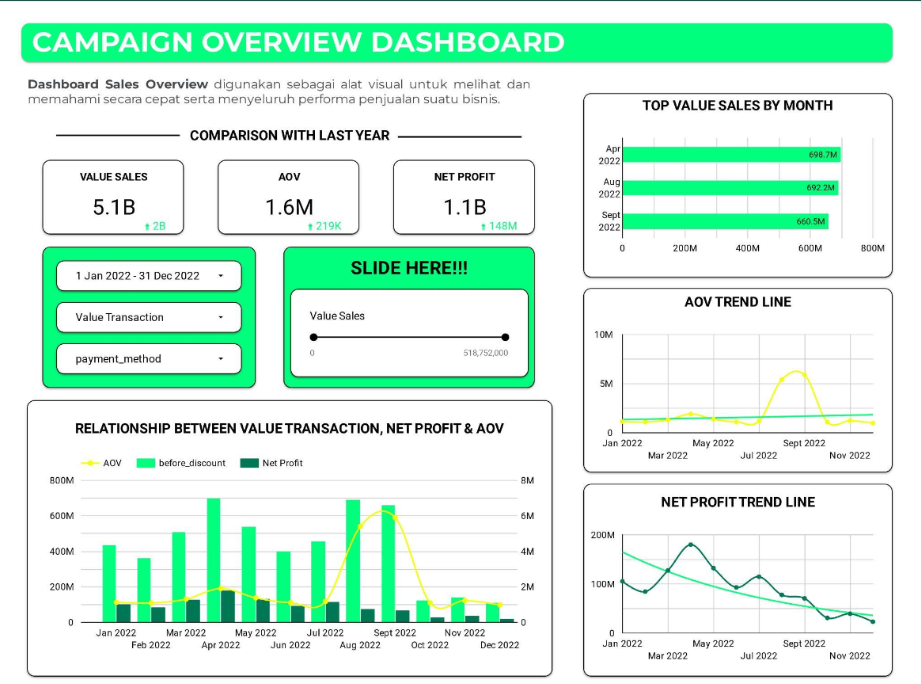
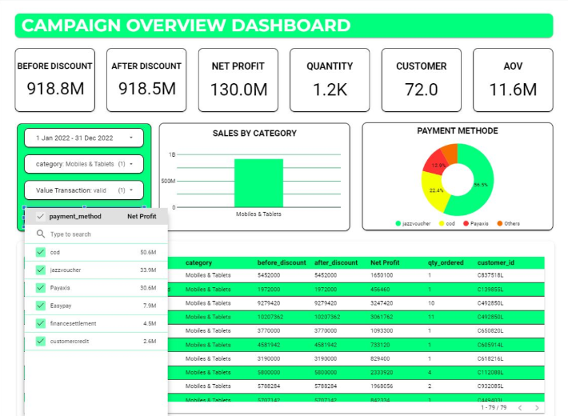

# 📊 Campaign Sales Performance Dashboard

## 📌 Project Overview  
This project presents an end-to-end analysis of 2022 sales campaign data.  
The goal is to provide a clear understanding of sales performance, customer behavior, and profitability through **interactive dashboards** and **business insights**.  

The dashboard was built using **Power BI** and highlights:  
- Value Sales  
- Net Profit  
- Average Order Value (AOV)  
- Customer and Quantity Analysis  
- Payment Method & Category Sales  

---

## 📷 Dashboard Preview  
### Sales Performance Overview  
  

### Category & Payment Method Analysis  
  

---

## 🔍 Key Insights  

1️⃣ **Sales Growth**  
- Total value sales in 2022 reached **5.1B**, an increase of **2B** compared to 2021.  
- Net Profit was **1.1B**, growing by **148M YoY**.  

2️⃣ **Seasonal Trends**  
- Significant sales spikes occurred in **Feb–Apr** and **Jun–Aug 2022**.  
- April was the strongest month with **698.7M sales**.  

3️⃣ **Average Order Value (AOV)**  
- AOV remained stable at **1.6M**, with minimal fluctuations throughout the year.  

4️⃣ **Profitability Challenge**  
- Net Profit showed a **downward trend** in the second half of 2022, suggesting possible discount pressure or cost inefficiencies.  

5️⃣ **Category & Customer Behavior**  
- **Mobiles & Tablets** recorded the highest sales contribution.  
- Customers preferred **COD, PayAxis, and JazzVoucher** as payment methods.  

---

## 💡 Business Recommendations  

1. **Replicate April Campaign Success**  
   - Analyze promotional strategies in April and replicate them in future campaigns.  

2. **Boost Profitability in H2**  
   - Review discount structures and operational expenses to counter declining profit trends.  
   - Optimize supply chain and marketing efficiency.  

3. **Increase Average Order Value (AOV)**  
   - Introduce upselling & cross-selling (bundle offers, premium product suggestions).  

4. **Category Focus Strategy**  
   - Prioritize *Mobiles & Tablets* marketing budget.  
   - Monitor growth opportunities in Beauty & Grooming as a potential secondary focus.  

5. **Payment Method Enhancement**  
   - Strengthen reliability of COD, PayAxis, and JazzVoucher.  
   - Consider loyalty rewards tied to preferred payment methods.  

6. **Customer Retention Programs**  
   - Implement loyalty points, cashback, or personalized offers.  
   - Target repeat purchases from high-value customers.  

---

## 🚀 Why This Project Matters  
This project demonstrates my ability to:  
- Transform raw transactional data into **clear business insights**.  
- Build **interactive dashboards** that communicate trends effectively.  
- Provide **data-driven recommendations** that align with business goals.  

---

---

⚡ *Data without insight is just numbers. This project shows how I turn numbers into strategies.*  
